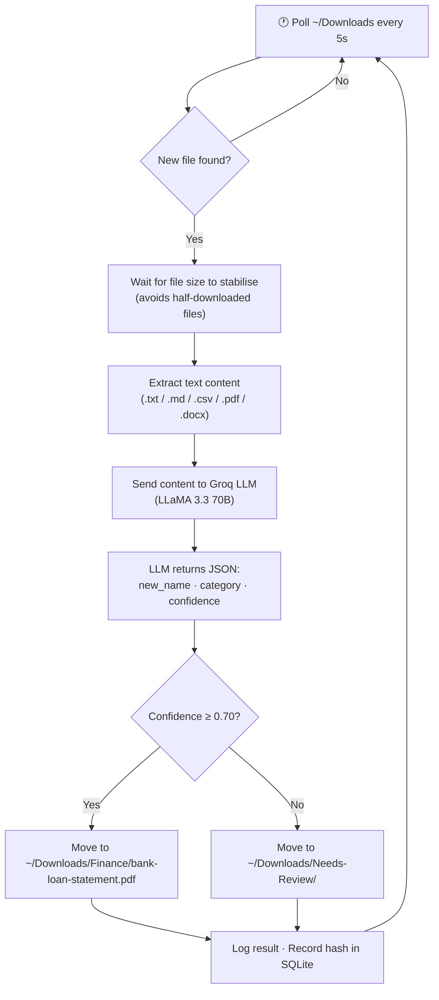

# File Segregator 🗂️

An AI agent that watches your **Downloads folder** every 5 seconds. When it spots a new file, it reads the content, uses an LLM to give it a clean 3-word name, and moves it directly into a category folder inside Downloads — automatically.

> Built with Python · Groq API (LLaMA 3.3 70B) · `uv` package manager

---

## Features

- 🔍 **Watches `~/Downloads`** — polls every 5 seconds for new files
- 🧠 **LLM-powered naming** — generates a descriptive 3-word kebab-case name (e.g. `bank-loan-statement`)
- 📁 **Auto-categorizes** into: `Finance`, `Work`, `Education`, `Personal`, `Legal`, `Misc`
- ⚠️ **Confidence gate** — files the LLM isn't sure about go to `Needs-Review` instead of being misfiled
- 🔒 **No duplicate processing** — tracks every file by content hash in SQLite, so restarts are safe
- ✅ **Stability check** — waits for a file's size to stop changing before touching it (safe for active downloads)
- 📝 **Full activity log** — every decision is logged to console and `logs/activity.log`
- 🧪 **Dry-run mode** — preview decisions without moving anything

---

## How It Works



---

## Tech Stack

| Layer | Tool | Purpose |
|---|---|---|
| Language | Python 3.11+ | Core runtime |
| Package manager | [uv](https://docs.astral.sh/uv/) | Fast, modern Python package manager |
| LLM | [Groq](https://console.groq.com) — `llama-3.3-70b-versatile` | File naming + categorization |
| Scheduling | `schedule` | Polling loop every N seconds |
| PDF reading | `pdfplumber` | Extracts text from PDF files |
| Word reading | `python-docx` | Extracts text from `.docx` files |
| State tracking | `sqlite3` (built-in) | Remembers processed files across restarts |
| Config | `python-dotenv` | Loads settings from `.env` |

---

## Prerequisites

Before you begin, make sure you have:

1. **Python 3.11+** — check with `python3 --version`
2. **uv** — install with:
   ```bash
   curl -LsSf https://astral.sh/uv/install.sh | sh
   ```
3. **A free Groq API key** — get one at [console.groq.com/keys](https://console.groq.com/keys) (no credit card needed)

---

## Setup

```bash
# 1. Clone the repository
git clone https://github.com/YOUR_USERNAME/file-segregator.git
cd file-segregator

# 2. Install all dependencies
uv sync

# 3. Create your config file
cp .env.example .env

# 4. Open .env and add your Groq API key
#    Replace: GROQ_API_KEY=your_groq_api_key_here
#    With:    GROQ_API_KEY=gsk_...your actual key...
```

That's it — no other configuration needed. The agent watches `~/Downloads` by default.

---

## Running

```bash
# Recommended: dry run first — shows what the agent WOULD do, without moving any files
uv run python main.py --dry-run

# Normal run — starts watching and organizing files in real time
uv run python main.py

# Change the polling interval (default is 5 seconds)
uv run python main.py --interval 15

# Watch a custom folder instead of ~/Downloads
uv run python main.py --watch-folder /path/to/folder
```

Press `Ctrl+C` to stop the agent at any time.

---

## Output Structure

Category folders are created **directly inside `~/Downloads`** — no extra nesting:

```
~/Downloads/
├── Finance/          ← invoices, bank statements, tax documents
├── Work/             ← meeting notes, reports, job descriptions
├── Education/        ← course notes, syllabi, research papers
├── Personal/         ← letters, personal documents
├── Legal/            ← contracts, agreements, affidavits
├── Misc/             ← anything that doesn't fit elsewhere
└── Needs-Review/     ← low-confidence files for you to check manually
```

These folders are created automatically when the agent starts — you don't need to make them manually.

---

## Configuration (Optional)

All settings live in `.env`. You only need to change these if you want custom paths:

| Variable | Default | Description |
|---|---|---|
| `GROQ_API_KEY` | *(required)* | Your Groq API key |
| `WATCH_FOLDER` | `~/Downloads` | Folder the agent monitors |
| `SORTED_ROOT` | `~/Downloads` | Where category subfolders are created |

---

## Activity Log

Every action is printed to the console and saved to `logs/activity.log`:

```
2024-01-15 10:32:00 [INFO] File Segregator agent starting
2024-01-15 10:32:00 [INFO] Watching: /Users/you/Downloads
2024-01-15 10:32:01 [INFO] Processing new file: invoice_dec.pdf
2024-01-15 10:32:03 [INFO] LLM decision: name='december-consulting-invoice', category='Finance', confidence=0.95
2024-01-15 10:32:03 [INFO] Moved 'invoice_dec.pdf' -> '.../Downloads/Finance/december-consulting-invoice.pdf'
```

---

## Project Structure

```
file-segregator/
├── .env.example      ← copy to .env and add your API key
├── pyproject.toml    ← project dependencies (managed by uv)
├── config.py         ← all settings: paths, categories, thresholds
├── main.py           ← entry point — CLI args + polling loop
├── watcher.py        ← detects new stable files in the watch folder
├── extractor.py      ← reads file content based on extension
├── llm_agent.py      ← builds the prompt, calls Groq, parses JSON response
├── file_actions.py   ← renames and moves files (the only module that touches the filesystem)
├── state_store.py    ← SQLite tracking — prevents duplicate processing
└── logs/             ← activity.log is auto-created here at runtime
```
